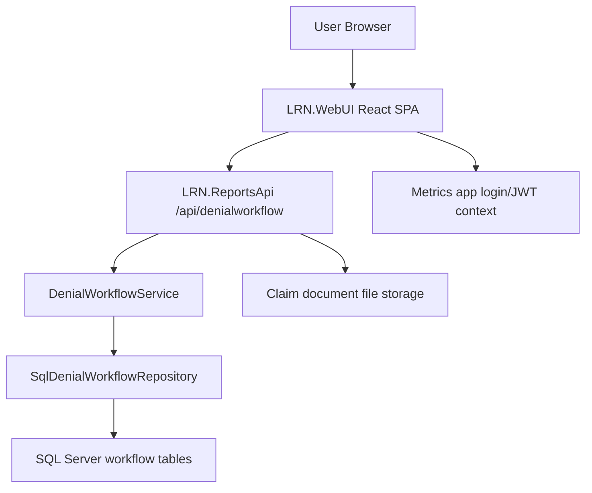

# LRN Denial Workflow - Project Description and Workflow Documentation

Date: 2026-06-03

## 1. Project Overview

The LRN Denial Workflow is a web-based denial management and claim worklist application used to track, assign, review, escalate, respond to, verify, and close denied or at-risk claim tasks across selected labs.

The system is split into two main runtime applications:

- `LRN.WebUI`: a React/Vite single-page application for the denial workflow user interface.
- `LRN.ReportsApi`: a .NET 8 Web API that exposes workflow data, task updates, claim notes, document upload/download, escalation handling, verification, reporting, and export endpoints.

The workflow uses SQL Server as the system of record for denial task board data, claim-level views, notes, documents, escalations, closed claims, closed claim history, verification tasks, and supporting indexes.

## 2. Business Purpose

The application helps revenue cycle teams:

- Identify claims requiring denial follow-up.
- Assign claim and line-level denial work to AR Reviewers.
- Track status, SLA, payer, denial code, denial classification, action category, and balance.
- Allow AR Reviewers to work their assigned claim/task list.
- Escalate claim or line issues to AR Managers, Client Managers, or Account Managers.
- Capture manager responses and route claims back to AR Reviewers for action.
- Track notes, documents, escalation history, and claim history.
- Move completed claims to closed claim history.
- Identify previously closed claims that reappear in later imports and route them to verification.
- Export claim-level detail asynchronously for larger datasets.

## 3. Main Repository Areas

| Area | Path | Purpose |
|---|---|---|
| React workflow UI | `LRN.WebUI` | Denial Workflow SPA |
| Reports API | `LRN.ReportsApi` | Workflow API and backend orchestration |
| API models | `LRN.ReportsApi/Models/WorkflowModels.cs` | DTOs and workflow data contracts |
| API controller | `LRN.ReportsApi/Controllers/DenialWorkflowController.cs` | HTTP endpoints |
| API service | `LRN.ReportsApi/Services/DenialWorkflowService.cs` | Business orchestration |
| SQL repository | `LRN.ReportsApi/Services/SqlDenialWorkflowRepository.cs` | SQL Server access |
| SQL setup/index scripts | `LRN.ReportsApi/Sql` | Workflow schema and performance indexes |
| Legacy MVC integration | `LabMetricsDashboard` | Existing metrics/dashboard shell and integration settings |

## 4. High-Level Architecture



## 5. Authentication and Authorization

The API reads identity and role information from JWT claims. The controller normalizes every request and does not trust role or user name values passed from the React query string.

Important JWT-derived values:

- User name: `ClaimTypes.Name`, `name`, `preferred_username`, `unique_name`, or `upn`.
- Role: `ClaimTypes.Role`, `role`, or `roles`.
- Lab access: token `lab_id` and `lab_name` claims, or fallback lookup using user name.

### Role Categories

| Role Category | Intended Access |
|---|---|
| Admin | Full workflow access, assignment, verification, escalation response |
| AR Manager | Claim assignment, verification, escalation response, exports, dashboards |
| AR Reviewer / AR Analyst | Assigned worklist, notes, documents, escalation submission, task updates |
| Client Manager | Escalation queue access; can update comments/documents only for Client Info Pending escalations |
| Account Manager | Similar external manager access; upload/delete gated by Client Info Pending logic |
| Read-only workflow role | Can view workflow but cannot update task status or submit escalations |

## 6. Primary UI Modules

### 6.1 Dashboard

Path: `LRN.WebUI/src/pages/DashboardPage.jsx`

Purpose:

- Shows high-level denial workflow KPIs.
- Displays classification/action/reviewer/SLA summaries.
- Supports drill-through into filtered claim or worklist views.

Key API calls:

- `GET /dashboard`
- `GET /reviewer-summary`
- `GET /filter-options`

### 6.2 Aging Dashboard

Path: `LRN.WebUI/src/pages/AgingDashboardPage.jsx`

Purpose:

- Shows outstanding aging by payer, classification, panel, and action category.
- Supports click-through filtering into claims/worklist.

Key API calls:

- `GET /aging-dashboard`

### 6.3 Claim Assignment / Claim View

Path: `LRN.WebUI/src/pages/ClaimAssignmentPage.jsx`

Purpose:

- Used by Admin and AR Manager to view claim-level queues.
- Supports claim assignment, claim line details, notes, documents, escalation, response, history, and export.
- External/read-only users can use it as a claim view depending on role routing.

Main tabs:

- New
- Unassigned
- Assigned
- Internal Escalation
- External Escalation
- Escalated Response
- Verification Claim
- Closed

Core actions:

- Assign selected claims to an AR Reviewer.
- Open claim drawer and inspect line-level tasks.
- Add claim notes.
- Upload supporting documents.
- Escalate claim or line items.
- Respond to internal escalations.
- View history.
- Download current tab or overall filtered claim details.

### 6.4 My Worklist

Path: `LRN.WebUI/src/pages/MyWorklistPage.jsx`

Purpose:

- AR Reviewer focused work queue.
- Groups task rows by claim.
- Shows claim drawer with line-level task details, notes, documents, and history.

Main tabs:

- New
- Assigned
- Escalate
- Escalated Response
- Closed

Core actions:

- Add claim or line notes.
- Update task status when allowed.
- Upload supporting documents.
- Escalate claim-level items.
- Review manager responses returned from escalation.

### 6.5 Escalation Queue

Path: `LRN.WebUI/src/pages/EscalationQueuePage.jsx`

Purpose:

- Manager-facing escalation queue.
- Supports claim-level and line-level escalation review.
- Allows manager/client/account responses.
- Shows related line tasks and uploaded documents.

Main modes:

- Claim escalation queue
- Line escalation queue
- Escalated Response mode

Core actions:

- Review escalation details.
- Add response note.
- Upload optional response document.
- Resolve escalation using response action.
- Reassign claim back to an AR Reviewer or unassigned queue.

### 6.6 Verification

Path: `LRN.WebUI/src/pages/VerificationPage.jsx`

Purpose:

- Used by Admin and AR Manager.
- Tracks claims/tasks that need validation after reappearing in later imports or after verification rules.
- Supports verification decision and claim assignment.

Key API calls:

- `GET /verification`
- `POST /decide-verification`

## 7. End-to-End Workflow

### 7.1 Import and Task Creation

1. Denial task rows are imported via `POST /import`.
2. Each import row requires a `UniqueTrackId`.
3. The service loads active tasks and historical tasks by unique tracking key.
4. If the unique key already exists as active, the task is updated while preserving state.
5. If the unique key exists in history, it is recreated and moved to verification.
6. If the unique key is new, a new task id is generated.
7. If an old active task no longer appears in the latest import:
   - Closed tasks are moved to history.
   - Non-closed tasks are moved to verification.

### 7.2 Claim Assignment

1. AR Manager/Admin opens Claim Assignment.
2. Claims are grouped and filtered by selected lab, queue tab, filters, role, and search text.
3. Manager selects claim rows and chooses an AR Reviewer.
4. `POST /assign-claims` assigns related task rows.
5. If selected tasks are already assigned and overwrite is not requested, the API returns conflicts.
6. User can confirm overwrite when appropriate.

### 7.3 AR Reviewer Work

1. AR Reviewer opens My Worklist.
2. API scopes the data to the logged-in reviewer.
3. Reviewer opens a claim drawer to see claim metadata and line tasks.
4. Reviewer can:
   - Add notes.
   - Upload documents.
   - Update task status.
   - Escalate the claim.
5. Work continues until task status is moved to a closed/completed state or escalation/verification routing applies.

### 7.4 Notes

Notes can be saved at:

- Claim level
- Line level

Fields:

- Lab id
- Claim id
- Optional task id
- Optional CPT code
- Note level
- Note text
- Status
- Next follow-up date
- Created by
- Created on

Rules:

- Note text is required.
- Client Manager can update comments only for Client Info Pending escalations.
- UI limits note text to 1500 characters and shows a live count.

### 7.5 Documents

Documents can be attached to a claim with optional contextual comments.

Supported behavior:

- Upload one or more files.
- Store metadata in `DenialClaimDocuments`.
- Store file content under `ClaimDocuments/{labId}/{claimId}` beneath the API base directory.
- Download by document id.
- Soft-delete by setting `IsDeleted = 1`.

Rules:

- Client/Account Manager upload and delete are allowed only for Client Info Pending escalations.
- Delete is blocked after a claim is closed or after manager/client/account response has moved the claim into response stage.
- UI hides delete buttons for closed and response-stage claims.
- Document comments are limited to 1500 characters in the UI.

### 7.6 Escalation Submission

Escalations can be claim-level or line-level.

Fields:

- Lab id
- Claim id
- Optional task id
- Optional CPT code
- Escalation level
- Escalation reason
- Comments
- Status
- Escalated to
- Escalated to role
- Next follow-up date
- Created by
- Created on

Typical reasons:

- EOB Pending
- Client Info Pending
- Document Required
- Others

Flow:

1. AR Reviewer or AR Manager selects claim/line.
2. User chooses reason and enters comments.
3. Escalation is saved via `POST /escalations`.
4. Task/claim is moved into an escalation state.
5. Manager-facing queue displays escalation.

### 7.7 Escalation Response

1. Manager opens escalation queue.
2. Manager reviews escalation note, related tasks, history, and documents.
3. Manager enters response note and optionally uploads documents.
4. Manager submits response through `POST /resolve-escalation`.
5. Depending on response action, tasks may be:
   - Closed
   - Returned for rework
   - Reassigned
   - Moved back to unassigned
   - Approved for write-off
6. Response-stage claims appear in Escalated Response queues for review.

### 7.8 Closed Claims

When task status is closed or completed:

1. Task rows are updated.
2. Claim-level closed status is generated when all related tasks are closed/completed.
3. Claim is merged into `DenialClosedClaims`.
4. A history row is inserted into `DenialClosedClaimsHistory`.
5. Closed claims are available through the Closed tab.
6. Document delete is not allowed for closed claims.

### 7.9 Verification

Verification is used for claims/tasks that need validation after a data change, import difference, or reappearance after closure.

Flow:

1. Task is moved into verification.
2. Admin/AR Manager reviews verification row.
3. `POST /decide-verification` records decision.
4. Invalid denials or closed statuses move out of active work.
5. Valid denial rows can remain or be routed back into active workflow.

## 8. Status and Queue Concepts

Common statuses:

- New
- Open
- Assigned
- In Progress
- Pending Review
- Pending Payer
- Pending Documentation
- Escalated
- External Escalation
- Response Escalation
- Escalated Response
- Verification Pending
- Closed
- Completed
- Duplicate

Queue tabs are not always direct database statuses. Some are computed views based on assignment, age, status, escalation existence, response markers, and closed claim presence.

## 9. Notifications

The UI contains a topbar notification control for claims needing attention.

Notification sections may include:

- Assigned claims
- Pending claims
- Action required claims
- Escalated response claims
- Escalation claims

Each notification section displays claim rows and routes the user into the matching workflow tab. The notification dropdown is designed to avoid overlapping claim id, action/status, payer, and SLA text.

## 10. Export Workflow

Claim-level export is asynchronous to support larger datasets.

Flow:

1. UI calls `POST /claims/export` with the current filter.
2. API creates an export job.
3. UI polls `GET /claims/export/{jobId}`.
4. When completed, UI downloads from `GET /claims/export/{jobId}/download`.
5. User can cancel pending/running jobs with `DELETE /claims/export/{jobId}`.

## 11. Key API Endpoints

Base route aliases:

- `/api/denialworkflow`
- `/api/denial-workflow`

| Method | Endpoint | Purpose |
|---|---|---|
| GET | `/health` | API health check |
| POST | `/import` | Import denial task rows |
| GET | `/me` | Current user context |
| GET | `/labs` | Labs available to user |
| GET | `/dashboard` | Dashboard summary |
| GET | `/aging-dashboard` | Aging dashboard |
| GET | `/filter-options` | Dropdown/filter values |
| GET | `/last-run-reference` | Last loaded source reference |
| GET | `/reviewers` | Reviewer options |
| GET | `/summary` | Workflow summary |
| GET | `/claim-menu-counts` | Claim/worklist tab counters |
| GET | `/reviewer-summary` | Reviewer workload |
| GET | `/insights` | Denial insights |
| GET | `/claims` | Claim-level rows |
| POST | `/claims/export` | Start export job |
| GET | `/claims/export/{jobId}` | Export job status |
| GET | `/claims/export/{jobId}/download` | Download completed export |
| DELETE | `/claims/export/{jobId}` | Cancel export job |
| GET | `/claims/{claimId}/tasks` | Tasks for a claim |
| GET | `/tasks` | Task board rows |
| GET | `/verification` | Verification rows |
| POST | `/assign-insight` | Assign by insight |
| POST | `/assign-claims` | Assign selected claims |
| POST | `/update-task` | Update task status/comments |
| GET | `/notes` | Get notes |
| POST | `/notes` | Save note |
| GET | `/claim-documents` | Get claim documents |
| POST | `/claim-documents` | Upload claim documents |
| GET | `/claim-documents/{documentId}/download` | Download claim document |
| DELETE | `/claim-documents/{documentId}` | Soft-delete claim document |
| GET | `/claim-history` | Claim/line history |
| GET | `/escalation-queue` | Escalation queue |
| POST | `/resolve-escalation` | Submit escalation response |
| GET | `/escalations` | Get escalation history |
| POST | `/escalations` | Save escalation |
| POST | `/update-escalation` | Update existing escalation |
| POST | `/decide-verification` | Save verification decision |

## 12. Main Data Contracts

Important DTOs:

- `DenialWorkflowFilter`
- `DenialWorkflowUserContext`
- `DenialWorkflowDashboardSummary`
- `AgingDashboardSummary`
- `DenialTaskImportRequest`
- `DenialTaskImportRow`
- `WorkflowTaskRow`
- `ClaimLevelRow`
- `AssignClaimRequest`
- `ClaimAssignmentResult`
- `UpdateTaskRequest`
- `VerificationTaskRow`
- `VerificationDecisionRequest`
- `DenialNoteRow`
- `SaveDenialNoteRequest`
- `ClaimDocumentRow`
- `DenialEscalationRow`
- `SaveDenialEscalationRequest`
- `UpdateDenialEscalationRequest`
- `DenialEscalationQueueRow`
- `ResolveDenialEscalationRequest`
- `DenialClaimHistoryRow`

## 13. Main SQL Tables

The repository ensures and uses several support tables. Important workflow tables include:

- `DenialTaskBoard`
- `DenialTaskHistory`
- `DenialVerificationTask`
- `DenialClaimNotes`
- `DenialClaimDocuments`
- `DenialClaimEscalations`
- `DenialClosedClaims`
- `DenialClosedClaimsHistory`
- Claim/line source tables such as `DenialClaimView`, `DenialLineItem`, and lab-specific claim data sources where present.

## 14. Data Retention and Audit Trail

Audit/history is retained through:

- Task history inserts during imports and updates.
- Claim notes.
- Escalation records.
- Document metadata.
- Closed claim history.
- Verification records.

Documents are soft-deleted in metadata. File cleanup is not described as a hard-delete behavior in the current API.

## 15. UI Validation and Text Limits

The UI enforces 1500-character limits with live counters on:

- Claim notes
- Task notes
- Escalation comments
- Escalation response notes
- Document comments

The API currently enforces required values for notes, escalation reasons, manager response notes, lab id, claim id, escalation id, and file selection where relevant.

## 16. Deployment Notes

### React UI

Path: `LRN.WebUI`

Local run:

```bash
npm install
npm run dev
```

Build:

```bash
npm install
npm run build
```

Deploy the generated `dist` folder to the target static hosting location, such as IIS.

API base URL configuration:

```env
VITE_DENIAL_API_BASE=https://localhost:62408/api/denialworkflow
```

If not set, the UI defaults to:

```text
https://localhost:7091/api/denialworkflow
```

### Reports API

Path: `LRN.ReportsApi`

Build:

```bash
dotnet build LRN.ReportsApi/LRN.ReportsApi.csproj
```

The API must be configured with SQL Server connection strings and any required JWT/security settings in the target environment.

## 17. Operational Checklist

Before release:

1. Confirm API URL in UI environment configuration.
2. Confirm workflow JWT/login integration.
3. Confirm lab access claims or fallback lab lookup.
4. Run SQL setup and index scripts as needed.
5. Confirm document storage path permissions under the API runtime directory.
6. Verify upload/download size limits.
7. Build React UI.
8. Build Reports API.
9. Smoke test:
   - Login
   - Select lab
   - Dashboard loads
   - Claims load
   - Worklist loads for AR Reviewer
   - Assignment works for AR Manager/Admin
   - Notes save
   - Documents upload/download
   - Escalation submit
   - Escalation response
   - Closed claim behavior
   - Verification queue
   - Export job lifecycle

## 18. Known Design/Behavior Rules

- AR Reviewer data is scoped to the logged-in reviewer.
- Client Manager and Account Manager write access is limited to Client Info Pending escalation contexts.
- Closed claims should be viewable but not editable for destructive document actions.
- Response-stage documents are download-only once escalation response is returned.
- Claim and worklist tabs use computed queue logic, not only raw status values.
- Large claim exports are asynchronous.
- UI text areas use 1500-character limits.

## 19. Glossary

| Term | Meaning |
|---|---|
| Claim UID | Normalized/grouping claim identifier used for claim-level views |
| Claim ID | Display claim id or visit/accession identifier depending on source |
| Task | Line-level denial work item |
| CPT | Procedure code associated with a line task |
| SLA | Service-level timing status based on due date/days remaining |
| Escalation | Request for manager/client/account input |
| Escalated Response | Manager response returned for AR review |
| Verification | Review queue for reappearing or uncertain denial rows |
| Closed Claim | Claim where all related denial tasks are completed/closed |

## 20. Summary

The LRN Denial Workflow is a role-based denial operations application that connects claim-level work queues, line-level task review, notes, documents, escalations, responses, verification, closed claim history, dashboards, aging analysis, notifications, and exports into one workflow. The React UI handles user interaction and role-specific navigation, while the .NET Reports API centralizes security scoping, business rules, SQL persistence, file metadata, and workflow state transitions.
