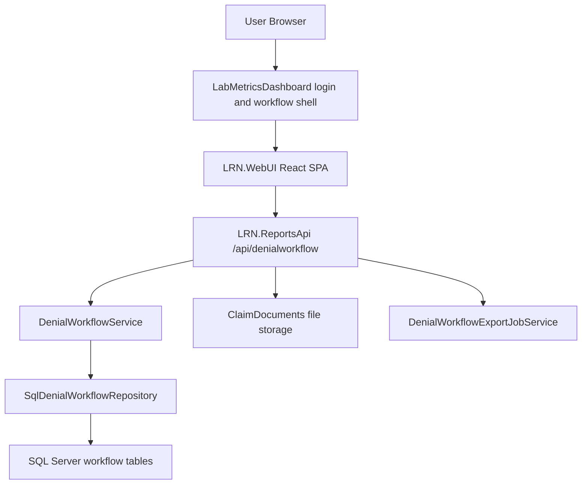

# LRN Denial Workflow - Project Requirements and Workflow Documentation

Date: 2026-06-07

## 1. Project Overview

The LRN Denial Workflow is a role-based denial management application used to triage, assign, work, escalate, respond to, verify, close, and export denied or at-risk claim work across selected labs.

The system currently has three integration surfaces:

- `LRN.WebUI`: React/Vite single-page application for the modern denial workflow.
- `LRN.ReportsApi`: .NET 8 Web API for workflow data, security normalization, claim/task state changes, notes, document metadata, escalation handling, verification, and exports.
- `LabMetricsDashboard`: legacy MVC dashboard shell that issues workflow JWTs, serves the workflow entry page, and retains compatibility models and proxy/integration code.

SQL Server is the system of record for task board rows, claim-level rollups, notes, documents, escalations, verification, closed-claim history, and performance indexes.

## 2. Business Purpose

The application helps revenue cycle teams:

- Identify claims requiring denial follow-up.
- Assign claim and line-level work to AR Reviewers.
- Track payer, panel, patient, denial code, denial classification, action category, priority, SLA, due dates, expected response dates, and balance.
- Let reviewers update work by claim, action group, denial classification, CPT, or selected lines.
- Escalate unclear or blocked work to AR Managers, Client Managers, or Account Managers.
- Capture manager responses, recommended next action, reassignment, and returned response work.
- Collect notes, documents, escalation history, and claim history.
- Prevent destructive document actions after closure or response-stage routing.
- Move completed claims to closed-claim history.
- Route reappearing or missing import rows to verification.
- Export filtered claim-level data through asynchronous jobs.

## 3. Main Repository Areas

| Area | Path | Purpose |
|---|---|---|
| React workflow UI | `LRN.WebUI` | Modern denial workflow SPA |
| API controller | `LRN.ReportsApi/Controllers/DenialWorkflowController.cs` | HTTP route surface under `/api/denialworkflow` and `/api/denial-workflow` |
| API models | `LRN.ReportsApi/Models/WorkflowModels.cs` | DTOs, filters, import/export contracts, row models |
| API service | `LRN.ReportsApi/Services/DenialWorkflowService.cs` | Business orchestration and closed/verification decisions |
| SQL repository | `LRN.ReportsApi/Services/SqlDenialWorkflowRepository.cs` | SQL Server persistence and query logic |
| Export jobs | `LRN.ReportsApi/Services/DenialWorkflowExportJobService.cs` | Async claim export lifecycle |
| API SQL scripts | `LRN.ReportsApi/Sql` | Setup, migrations, closed claims, manager review, and performance indexes |
| Role queue config | `LRN.WebUI/src/config/workflowRoleQueues.js` | Per-role queue and filter visibility definitions |
| UI API client | `LRN.WebUI/src/services/denialWorkflowService.js` | Frontend endpoint wrapper |
| Legacy shell | `LabMetricsDashboard` | Login/JWT context and legacy workflow integration |

## 4. High-Level Architecture



## 5. Authentication and Authorization Requirements

The API derives identity from JWT claims and normalizes role/user context on each request. The controller must not trust user name, role, or lab access values sent from the query string when a token provides those values.

JWT-derived values:

- User name: `ClaimTypes.Name`, `name`, `preferred_username`, `unique_name`, or `upn`.
- Role: `ClaimTypes.Role`, `role`, or `roles`.
- Lab access: `lab_id` and `lab_name` claims, with fallback lookup by user name.

Role behavior:

| Role Category | Required Access |
|---|---|
| Admin | Full workflow access, assignment, verification, escalation response, dashboards, exports |
| AR Manager | Claim assignment, verification, escalation response, dashboards, exports |
| AR Reviewer / AR Analyst | Assigned worklist, status updates, notes, documents, escalation submission |
| Client Manager | External escalation/worklist access; comment and document actions only when Client Info Pending rules allow |
| Account Manager | Same external-manager pattern as Client Manager |
| Read-only workflow role | View/download where allowed; no task updates or escalation submission |

## 6. UI Modules and Requirements

### 6.1 App Shell and Routing

Path: `LRN.WebUI/src/App.jsx`

The app shell loads `/me`, labs, reviewers, filter options, tab counts, dashboards, and export state. It routes users to views based on role and active queue. Claim tab route aliases such as `response` and `verification` normalize into the active claim/worklist views.

### 6.2 Dashboard

Path: `LRN.WebUI/src/pages/DashboardPage.jsx`

Requirements:

- Show denial workflow KPIs, classification/action/reviewer/SLA summaries, and drill-through links.
- Use `GET /dashboard`, `GET /reviewer-summary`, and `GET /filter-options`.
- Respect selected lab and role-scoped filters.

### 6.3 Aging Dashboard

Path: `LRN.WebUI/src/pages/AgingDashboardPage.jsx`

Requirements:

- Show outstanding aging by payer, classification, panel, action category, and aging bucket.
- Support click-through into filtered claims/worklists.
- Use `GET /aging-dashboard`; API also supports `GET /aging`.

### 6.4 Claim Assignment and Claim View

Path: `LRN.WebUI/src/pages/ClaimAssignmentPage.jsx`

Requirements:

- Used by Admin/AR Manager for assignment and by external/read-only roles as a claim-level view where routed.
- Display grouped claim rows and a claim drawer with line tasks, notes, documents, and history.
- Support claim assignment with conflict detection and optional overwrite.
- Support claim/line escalation, escalation response, document upload/download/delete, note history, and tab exports.

Manager queues currently include:

- New
- Unassigned
- Assigned
- Payer Followup
- Pending Documentation
- Internal Escalation
- External Escalation
- Escalation Response
- Write Off Approval
- Closed
- All Claims

### 6.5 My Worklist

Path: `LRN.WebUI/src/pages/MyWorklistPage.jsx`

Requirements:

- Scope AR Reviewer rows to the logged-in reviewer.
- Group task rows by claim and show drawer tabs for Tasks, Notes, Documents, and History.
- Support status updates by scope: By Claim, By Action Group, By Denial Classification, By CPT, or By Selected Lines.
- Protect closed and escalated lines from claim-wide overwrite.
- Require `Action Completed = Yes` when moving a task to `Pending Payer Response`.
- Auto-select an actual outcome for Pending Payer Response based on line action context.
- Require documentation type for `Pending Documentation`.
- Support claim-level or scoped escalation to AR Manager.

Reviewer queues currently include:

- Worklist
- Payer Followup Queue
- Pending Documentation
- Pending Payer Response
- Escalation Response
- Closed
- All Claims

### 6.6 Escalation Queue

Path: `LRN.WebUI/src/pages/EscalationQueuePage.jsx`

Requirements:

- Show claim-level and line-level escalations.
- Allow manager/external responses with response note, recommended next action, optional reassignment, and optional supporting documents.
- Route resolved items into response-stage work where the reviewer can act on the returned response.
- Preserve escalation scope fields: claim, specific CPT/task, action group, denial classification, affected task ids, and scope display text.

### 6.7 Verification

Path: `LRN.WebUI/src/pages/VerificationPage.jsx`

Requirements:

- Used by Admin and AR Manager.
- Show rows requiring validation after reappearance, import differences, or missing rows.
- Support valid/invalid denial decisions through `POST /decide-verification` or `POST /verification/decision`.

### 6.8 Insights and Task Views

Paths:

- `LRN.WebUI/src/pages/InsightPage.jsx`
- `LRN.WebUI/src/pages/TasksPage.jsx`
- `LRN.WebUI/src/pages/DenialSummaryPage.jsx`

Requirements:

- Continue supporting insight assignment, task board views, and denial summary pages for workflow analysis and reviewer assignment.

## 7. Role Queue and Filter Requirements

Path: `LRN.WebUI/src/config/workflowRoleQueues.js`

The frontend must use role-specific queue definitions and clear filters that are hidden for the active queue.

Role queue matrix:

| Role Key | Queues |
|---|---|
| `arReviewer` | assigned, payerFollowup, pendingDocumentation, pendingPayerResponse, escalationResponse, closed, all |
| `arManager` | new, unassigned, assigned, payerFollowup, pendingDocumentation, internalEscalation, externalEscalation, escalationResponse, writeOffApproval, closed, all |
| `clientManager` | new, unassigned, assigned, closed, all |
| `accountManager` | new, unassigned, assigned, closed, all |

Queue aliases normalize common names such as `open` to `assigned`, `response` to `escalationResponse`, `writeoff` to `writeOffApproval`, and `allclaims` to `all`.

## 8. End-to-End Workflow

### 8.1 Import and Task Creation

1. Denial task rows are imported through `POST /import`.
2. Each import row requires `UniqueTrackId`.
3. Incoming rows are de-duplicated by `UniqueTrackId`.
4. Existing active tasks are updated while preserving workflow state.
5. Previously historical tasks that reappear are recreated and moved to verification.
6. New rows receive generated task ids.
7. Active rows absent from the latest import are moved to history if closed, otherwise moved to verification.

### 8.2 Assignment

1. Admin/AR Manager opens Claim Assignment.
2. Claims are grouped and filtered by lab, queue, role, search text, and visible filters.
3. Manager selects claims and reviewer.
4. `POST /assign-claims` assigns all matching task rows for each claim.
5. Existing assignment conflicts return conflict details unless overwrite is requested.

### 8.3 Reviewer Status Updates

Task updates use `POST /update-task` and can include:

- `Status`
- `Comments`
- `ActionCompleted`
- `ActualOutcome`
- `DocumentationType`
- `FollowUpReason`
- `ClosureReason`
- `SyncConfirmation`
- `ValidationStatus`
- `ExpectedResponseDate`
- `UpdateScope`
- `UpdateScopeValue`

Supported reviewer statuses include:

- Assigned
- Payer Follow-up Required
- Pending Payer Response
- Pending Documentation
- Write-Off Pending Approval
- Closed

### 8.4 Notes

Notes can be saved at claim or line level. The UI limits note text to 1500 characters and displays live counts.

Required fields:

- Lab id
- Claim id
- Note level
- Note text
- Created by

Optional fields:

- Task id
- CPT code
- Status
- Next follow-up date

Client Manager and Account Manager write access remains restricted to Client Info Pending contexts.

### 8.5 Documents

Documents are attached to claims with optional comments and stored under `ClaimDocuments/{labId}/{claimId}` beneath the API base directory. Metadata is stored in `DenialClaimDocuments`.

Required behavior:

- Upload one or more files with comment and uploader.
- Download by document id.
- Soft-delete by marking metadata deleted.
- Block delete after claim closure.
- Block delete when the claim is in escalation response stage.
- Allow Client/Account Manager upload/delete only for Client Info Pending contexts.
- Limit document comments to 1500 characters in the UI.

### 8.6 Escalation Submission

Escalations may apply to:

- Overall Claim
- Specific CPT/task
- Action Group
- Denial Classification

Escalation records include reason, comments, status, target user/role, scope fields, affected task ids, recommended next action, and next follow-up date.

Typical reviewer escalation reasons include:

- Denial reason unclear
- Action clarification required
- Denial-action mapping unclear
- Payer policy conflict
- Appeal eligibility unclear
- Rebill eligibility unclear
- Write-off decision required
- Payer follow-up guidance needed
- Documentation requirement unclear
- EOB / payer response clarification
- Other

Saving an escalation creates or updates `DenialClaimEscalations` and moves affected tasks to `Escalated to AR Manager`.

### 8.7 Escalation Response

Manager/external users resolve escalation records through `POST /resolve-escalation`.

Resolution payload includes:

- Escalation id
- Claim/task/CPT context
- Escalation level
- Resolution action
- Response note
- Recommended next action
- Reassign-to user
- Action by

The response should preserve history, route tasks to the expected response-stage queue, and optionally reassign work to a reviewer or unassigned queue.

### 8.8 Closed Claims

Closed/completed rows are handled as closed statuses from `DenialWorkflowOptions.ClosedStatuses`, currently `Closed` and `Completed`.

Required behavior:

- Update task rows.
- Merge claim closure into `DenialClosedClaims`.
- Insert audit records in `DenialClosedClaimsHistory`.
- Keep closed claims visible in Closed queues.
- Disable destructive document actions for closed claims.

### 8.9 Verification

Verification rows are created when a task reappears from history or active rows disappear from the latest import while not closed.

Verification decision behavior:

- Invalid denial or closed status moves row out of active workflow.
- Valid denial can remain or be routed back into active work.
- Decision records include comments, status, updated-by/action-by values, and verification timestamps.

## 9. Status and Queue Concepts

Statuses are workflow state values. Queue tabs are computed views and are not always direct database status values.

Important active statuses:

- New
- Open
- Assigned
- In-Progress / In Progress
- Pending Review
- Payer Follow-up Required
- Pending Payer Response
- Pending Documentation
- Escalated to AR Manager
- Internal Escalation
- External Escalation
- Response Escalation
- Escalated Response
- Write-Off Pending Approval
- Verification Pending
- Closed
- Completed
- Duplicate

Queue computation may use assignment, status, work-flow status, escalation existence, response markers, expected response dates, closed-claim presence, and role.

## 10. Notifications

The UI includes a topbar notification control for claims needing attention.

Notification sections may include:

- Assigned claims
- Pending claims
- Action-required claims
- Escalated response claims
- Escalation claims

Notification rows should route to the relevant workflow tab and avoid visual overlap between claim id, action/status, payer, and SLA text.

## 11. Export Workflow

Claim-level export is asynchronous.

1. UI calls `POST /claims/export` with the current filter.
2. API creates an export job.
3. UI polls `GET /claims/export/{jobId}`.
4. Completed jobs are downloaded from `GET /claims/export/{jobId}/download`.
5. Pending/running jobs can be cancelled with `DELETE /claims/export/{jobId}`.

Endpoint aliases `POST /claim-level/export` are also supported.

## 12. Key API Endpoints

Base routes:

- `/api/denialworkflow`
- `/api/denial-workflow`

| Method | Endpoint | Alias(es) | Purpose |
|---|---|---|---|
| GET | `/health` | | API health |
| POST | `/import` | | Import denial task rows |
| GET | `/me` | | Current user context |
| GET | `/labs` | | Labs available to user |
| GET | `/dashboard` | | Dashboard summary |
| GET | `/aging-dashboard` | `/aging` | Aging dashboard |
| GET | `/filter-options` | | Dropdown/filter values |
| GET | `/last-run-reference` | | Last loaded source reference |
| GET | `/reviewers` | | Reviewer options |
| GET | `/summary` | | Workflow summary |
| GET | `/claim-menu-counts` | `/claim-counts`, `/claims/status-counts`, `/my-worklist/counts` | Queue counters |
| GET | `/reviewer-summary` | | Reviewer workload |
| GET | `/insights` | | Denial insights |
| GET | `/claims` | `/claim-level` | Claim-level rows |
| POST | `/claims/export` | `/claim-level/export` | Start export job |
| GET | `/claims/export/{jobId}` | | Export job status |
| GET | `/claims/export/{jobId}/download` | | Download completed export |
| DELETE | `/claims/export/{jobId}` | | Cancel export job |
| GET | `/claim-tasks` | | Tasks for claim query route |
| GET | `/claims/{claimId}/tasks` | | Tasks for claim route |
| GET | `/tasks` | | Task board rows |
| GET | `/verification` | | Verification rows |
| POST | `/assign-insight` | `/assign-by-insight` | Assign by insight |
| POST | `/assign-claims` | `/assign-by-claim` | Assign selected claims |
| POST | `/update-task` | `/task/update` | Update task status/comments |
| GET | `/notes` | | Get notes |
| POST | `/notes` | | Save note |
| GET | `/claim-documents` | | Get claim documents |
| POST | `/claim-documents` | | Upload claim documents |
| GET | `/claim-documents/{documentId}/download` | | Download document |
| DELETE | `/claim-documents/{documentId}` | | Soft-delete document |
| GET | `/claim-history` | `/claims/{claimId}/history` | Claim/line history |
| GET | `/escalation-queue` | | Escalation queue |
| POST | `/resolve-escalation` | | Submit escalation response |
| GET | `/escalations` | | Get escalation history |
| POST | `/escalations` | | Save escalation |
| POST | `/update-escalation` | | Update escalation |
| POST | `/decide-verification` | `/verification/decision` | Save verification decision |

## 13. Main Data Contracts

Important DTOs in `LRN.ReportsApi/Models/WorkflowModels.cs`:

- `DenialWorkflowFilter`
- `DenialWorkflowFilterOptions`
- `DenialWorkflowUserContext`
- `DenialWorkflowDashboardSummary`
- `AgingDashboardSummary`
- `DenialTaskImportRequest`
- `DenialTaskImportRow`
- `DenialWorkflowImportResult`
- `ClaimExportStartResponse`
- `ClaimExportStatusResponse`
- `ClaimSubMenuCounts`
- `DenialWorkflowInsightRow`
- `WorkflowTaskRow`
- `VerificationTaskRow`
- `ClaimLevelRow`
- `AssignClaimRequest`
- `ClaimAssignmentResult`
- `UpdateTaskRequest`
- `VerificationDecisionRequest`
- `DenialNoteRow`
- `SaveDenialNoteRequest`
- `ClaimDocumentRow`
- `DenialEscalationRow`
- `SaveDenialEscalationRequest`
- `UpdateDenialEscalationRequest`
- `DenialEscalationQueueRow`
- `ResolveDenialEscalationRequest`
- `DenialClaimHistoryRow`

## 14. Main SQL Tables and Scripts

Important workflow tables:

- `DenialStatusMaster`
- `DenialActionCategoryMaster`
- `DenialTaskBoard`
- `DenialTaskHistory`
- `DenialVerificationTask`
- `DenialClaimNotes`
- `DenialClaimDocuments`
- `DenialClaimEscalations`
- `DenialClosedClaims`
- `DenialClosedClaimsHistory`
- Source/line tables such as `DenialClaimView`, `DenialLineItem`, `DenialInsight`, and lab-specific claim data tables where present

Important SQL scripts:

- `DenialWorkflow_Setup.sql`: status/action masters, task history, verification table, base task-board columns.
- `DenialWorkflow_ClaimNotes_Documents.sql`: note/document support tables.
- `DenialClosedClaimsHistory_Setup.sql`: closed claim and closed claim history support.
- `DenialWorkflow_StatusModel_ManagerReview_20260604.sql`: manager review/status update columns, escalation scope columns, and related indexes.
- `DenialWorkflow_Performance_And_Verification_Columns.sql`: verification column expansion and paging/search indexes.
- `DenialWorkflow_AllTables_Performance_Indexes.sql`: broad workflow index package.
- `DenialWorkflow_ClaimUID_ClaimView_Optimization.sql`: claim UID and claim view optimization.
- `DenialWorkflow_ClaimStatus_Precedence_RoleFilters.sql`: claim status precedence and role-filter support.
- `DenialWorkflow_MyWorklist_Escalations.sql`: worklist escalation support.
- `DenialWorkflow_400k_Performance_Indexes.sql`, `DenialWorkflow_Loading_Optimization_Indexes.sql`, `DenialWorkflow_Index_Maintenance.sql`: scaling and maintenance scripts.

## 15. Data Retention and Audit Trail

Audit/history is retained through:

- `DenialTaskHistory` inserts during imports and task updates.
- Claim notes.
- Escalation records and responses.
- Document metadata.
- Closed claim rows and closed claim history.
- Verification records.

Documents are soft-deleted in metadata. The current API does not describe a hard-delete file cleanup process.

## 16. Validation and Text Limits

Frontend text limit:

- `MAX_TEXT_LENGTH = 1500`
- Applied to notes, status comments, escalation comments, escalation response notes, and document comments.

API validation requirements:

- Note text is required.
- Escalation reason/comments are required where applicable.
- Manager response notes are required for response actions.
- Lab id, claim id, escalation id, and file selection are required for relevant calls.
- Pending Payer Response requires action completion in the UI.
- Client/Account Manager edit and document actions are gated by Client Info Pending logic.

## 17. Deployment Notes

### React UI

Path: `LRN.WebUI`

Local run:

```bash
npm install
npm run dev
```

Build:

```bash
npm install
npm run build
```

API base URL:

```env
VITE_DENIAL_API_BASE=https://localhost:62408/api/denialworkflow
```

If not set, the UI default is:

```text
https://localhost:7091/api/denialworkflow
```

### Reports API

Path: `LRN.ReportsApi`

Build:

```bash
dotnet build LRN.ReportsApi/LRN.ReportsApi.csproj
```

Required environment setup:

- SQL Server connection strings.
- JWT/security configuration.
- Document storage permissions under the API runtime directory.
- SQL setup/migration/index scripts applied to target lab databases as needed.

## 18. Operational Checklist

Before release:

1. Confirm API URL in UI environment configuration.
2. Confirm workflow JWT/login integration from `LabMetricsDashboard`.
3. Confirm lab access claims or user lab lookup.
4. Apply required SQL setup and migration scripts.
5. Confirm indexes for expected production volume.
6. Confirm document storage path permissions.
7. Verify upload/download size limits.
8. Build React UI.
9. Build Reports API.
10. Smoke test login, lab selection, dashboards, claims, worklist, assignment, scoped status updates, notes, documents, escalation submit, escalation response, closed claim behavior, verification, and export lifecycle.

## 19. Known Design and Behavior Rules

- AR Reviewer data is scoped to the logged-in reviewer.
- Admin and AR Manager can assign claims and process verification.
- Client Manager and Account Manager write actions are limited to Client Info Pending contexts.
- Closed claims are viewable but protected from destructive document actions.
- Response-stage documents are download-only once escalation response returns.
- Claim and worklist tabs use computed queue logic.
- Claim IDs may use normalized/grouping values such as `ClaimUID` and `ClaimIDNormalized`.
- Large claim exports are asynchronous.
- UI text areas use 1500-character limits.
- Hidden filters must be cleared when switching to a queue that does not expose them.

## 20. Glossary

| Term | Meaning |
|---|---|
| Claim UID | Normalized/grouping claim identifier for claim-level views |
| Claim ID | Display claim id or visit/accession identifier depending on source |
| Task | Line-level denial work item |
| CPT | Procedure code associated with a line task |
| SLA | Timing status based on due date/days remaining |
| Action Category | Work classification such as Appeal, Rebill, Write Off, Client Info Pending, Manual Review |
| Expected Response Date | Follow-up date used for payer, documentation, or escalation response tracking |
| Escalation Scope | Claim, CPT/task, action group, or denial classification affected by an escalation |
| Escalated Response | Manager response returned for reviewer action |
| Verification | Review queue for reappearing, missing, or uncertain denial rows |
| Closed Claim | Claim where related denial workflow tasks are closed/completed |

## 21. Summary

The LRN Denial Workflow is a role-scoped denial operations system connecting dashboards, claim assignment, reviewer work queues, structured status updates, notes, documents, escalations, manager responses, verification, closed claim history, notifications, and asynchronous exports. The React UI owns the role-aware workflow experience, while the .NET Reports API centralizes security normalization, business rules, SQL persistence, file metadata, export jobs, and workflow state transitions.
