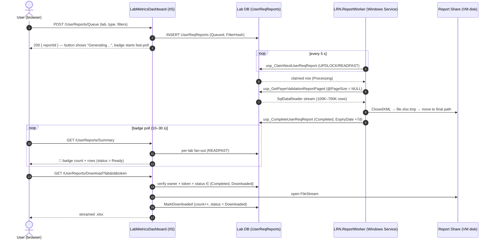
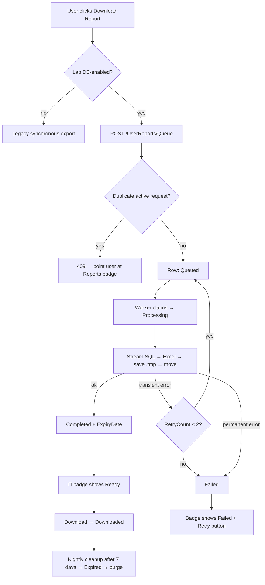

# Asynchronous Report Generation — Technical Design

**Scope:** Payer Policy Validation Report (first implementation). Architecture is generic — ForecastingSummary, ExecutiveSummary, ProductionReport, CollectionReport, and LisSummary plug in later by adding one generator class each.
**Stack:** ASP.NET Core (.NET 9) · SQL Server (per-lab DBs) · ClosedXML · Windows Server / IIS · LRN.ReportWorker Windows Service.
**Version:** 1.0 · **Last reviewed:** 2026-08-16
**Status:** Implemented — projects `LRN.ReportQueue.Shared`, `LRN.ReportWorker`, web changes in `LabMetricsDashboard`, SQL in `SQL_Scripts/UserReqReports/`.

---

## 1. Database Design

The queue table `UserReqReports` is deployed to **each lab database** (decision: per-lab hosting; the web app's "My Reports" view fans out across labs in parallel). Scripts: `SQL_Scripts/UserReqReports/01_UserReqReports_Schema.sql`.

| Column | Type | Notes |
|---|---|---|
| ReportId | BIGINT IDENTITY PK | FIFO ordering key |
| ReportType | VARCHAR(50) | `PayerPolicyValidation`, later `ForecastingSummary`, … |
| LabName | VARCHAR(50) | Redundant in a per-lab DB but keeps worker/web code generic and audit self-describing *(added, justified)* |
| RequestedBy | NVARCHAR(100) | `ClaimTypes.Name` |
| RequestedByUserId | INT NULL | `LabUserID` claim *(added — joins to user mgmt without name coupling)* |
| RequestedDate | DATETIME2(0) | default `SYSDATETIME()` |
| GenerationStatus | TINYINT FK → UserReqReportStatus | see §6 |
| FilterDetails | NVARCHAR(MAX), `ISJSON` CHECK | JSON snapshot of the filters |
| FilterHash | CHAR(64) | SHA-256 of type+lab+filters *(added — duplicate-request guard)* |
| FileName / FilePath | NVARCHAR(260) / NVARCHAR(1024) | path never leaves the server |
| FileSizeBytes | BIGINT | shown in UI |
| ReportRowCount | INT | rows written *(added — UX + perf tuning)* |
| StartedDate / CompletedDate | DATETIME2(0) | duration = difference |
| ErrorMessage | NVARCHAR(2000) | |
| RetryCount | TINYINT | *(added — auto-retry bookkeeping)* |
| WorkerName | NVARCHAR(100) | machine\instance that claimed the job *(added — multi-worker diagnostics)* |
| DownloadCount / FirstDownloadedDate / LastDownloadedDate | INT / DATETIME2 | |
| ExpiryDate | DATETIME2(0) | CompletedDate + 7 days |
| DownloadToken | UNIQUEIDENTIFIER default NEWID() | *(added — unguessable download URL, blocks ID enumeration)* |
| CreatedDate / UpdatedDate | DATETIME2(0) | |

**Indexes**

- `IX_UserReqReports_QueuePickup` — filtered `WHERE GenerationStatus = 1` on `(ReportId)`: the poll query touches a tiny index no matter how large the table grows.
- `IX_UserReqReports_User` `(RequestedBy, GenerationStatus)` + covering INCLUDEs — badge/panel query is a single seek.
- `IX_UserReqReports_Expiry` — filtered on Completed/Downloaded, keyed by `ExpiryDate` for the nightly sweep.
- `UX_UserReqReports_ActiveDuplicate` — unique filtered `(RequestedBy, ReportType, FilterHash) WHERE GenerationStatus IN (1,2)`: the same user cannot queue the identical report twice while one is active. Enforced by the engine, not by racy application checks.

`UserReqReportStatus` is the status lookup; `UserReqReportsAudit` records every status transition via trigger `trg_UserReqReports_Audit` (survives all code paths, incl. manual SQL fixes).

## 2. Background Processing

**Recommendation: .NET Worker Service hosted as a Windows Service** (`Host.CreateDefaultBuilder().UseWindowsService()`), exactly like the existing `LRN.MasterFileProcessorWorker`.

- vs **plain console app + Task Scheduler**: no supervision, no automatic restart on crash, no clean SCM stop signal (graceful `CancellationToken`-based shutdown matters when a 700K-row workbook is mid-write).
- vs **classic Windows Service (ServiceBase)**: legacy template, no DI/ILogger/IHostedService integration, harder to run/debug as a console during development. A Worker Service *is* a Windows Service when installed with `sc create`, and a console app under a debugger — best of both.
- vs **IIS-hosted `IHostedService` in the web app**: IIS recycles app pools; a recycle mid-generation kills the report. Report generation must not share the web process.

**Workflow inside the worker**

```
Queued ─(usp_ClaimNextUserReqReport: UPDLOCK/READPAST/ROWLOCK, FIFO)→ Processing
  → Generating Excel   (SqlDataReader streams usp_GetPayerValidationReportPaged @PageSize=NULL)
  → Saving File        (write {path}.tmp → atomic File.Move to final .xlsx)
  → Updating Database  (usp_CompleteUserReqReport: FileName/Path/Size/RowCount, ExpiryDate = +7d)
  → Completed
  ↘ on exception → usp_FailUserReqReport
       transient (SQL timeout/deadlock/connection, IO sharing) → RetryCount++ → back to Queued (max 2)
       permanent (bad filters, disk full, unknown type)         → Failed
```

Poll loop: every `PollIntervalSeconds` (5 s) the worker round-robins all configured lab DBs, claims at most as many jobs as free slots on a `SemaphoreSlim(MaxConcurrentReports)`. One unreachable lab DB is logged and skipped — the others keep flowing. On startup `usp_ResetStuckUserReqReports` re-queues rows orphaned in Processing by a crash.

## 3. Report Generation Flow





## 4. File Storage

Stored on the VM disk, root from config (`ReportStorage:RootPath`, same value in web + worker appsettings):

```
E:\LRN-Data\GeneratedReports\
    PayerPolicyValidation\
        2026\
            July\
                jsmith\
                    Phi_Life_PayerPolicyValidation_20260717143020.xlsx
```

- Lab name is in the *file* name (matches the existing export convention), user/month in the folder; `ReportFilePathBuilder.Sanitize` strips path characters so user/lab values can never escape the root.
- Root is **outside the IIS web root** — no static URL can ever reach a report; only the authenticated Download action streams files.
- Write as `*.tmp`, then `File.Move` — the DB never points at a half-written workbook.
- Requirements: IIS app-pool identity needs **read+delete**, worker service account **read/write/delete** on the root.

## 5. Notification Design

The existing notification bell (`navBellWrap`, Payer-mapping) is **untouched**. A second, independent badge is added in `_Layout.cshtml`:

```
🔔 Notifications (3)    📄 Reports (2)
```

Clicking 📄 opens a panel listing each request: Report Name · Lab · Requested Date · row count / size · **Status chip** (Ready / Processing / Queued / Failed / Downloaded) · **Download** · **Retry** (Failed only) · **Delete**. Data comes from `GET /UserReports/Summary`, which fans out to all DB-enabled labs in parallel (a down lab degrades gracefully). Polling is adaptive: 30 s idle, 10 s while anything is Queued/Processing, immediate refresh when the panel opens or an export is queued (`window.lrnReportsBadgeRefresh()`).

## 6. Status Management

| Value | Status | Meaning / transitions |
|---|---|---|
| 1 | Queued | Insert state; also target of Retry and auto-retry |
| 2 | Processing | Claimed by worker (`WorkerName`, `StartedDate` set) |
| 3 | Completed | File on disk, `ExpiryDate = +7d`; **shown as "Ready"** |
| 4 | Failed | Retries exhausted or permanent error; Retry button → 1 |
| 5 | Downloaded | ≥1 download; still downloadable until expiry |
| 6 | Expired | Past ExpiryDate; file deleted by cleanup |
| 7 | Deleted | User removed it; file deleted immediately |
| 8 | Cancelled | Reserved (cancel-while-queued, future) |

Legal transitions are enforced by guarded `UPDATE … WHERE GenerationStatus = expected` statements; every transition is written to `UserReqReportsAudit` by trigger.

## 7. Cleanup Strategy

`ReportCleanupWorker` (second hosted service in the same Windows Service) runs daily at `ReportWorker:CleanupTime` (02:00):

1. **SQL cleanup** — `usp_ExpireUserReqReports`: Completed/Downloaded past `ExpiryDate` → Expired, returns file paths.
2. **File cleanup** — worker deletes each returned file. **Missing file = warning + continue** (status already updated, never an error). Locked file = warning; the purge window retries the situation later.
3. **Purge** — `usp_PurgeUserReqReports`: hard-deletes terminal rows (Failed/Expired/Deleted/Cancelled) older than 90 days; audit rows kept 365 days.
4. Empty user/month folders pruned.
5. User **Delete** removes the physical file immediately (web side); the nightly sweep is the safety net.

**Audit history** — `UserReqReportsAudit` keeps the full status timeline per request for a year, independent of queue purging.

## 8. Performance

- **Streaming, not materializing:** the worker reads `usp_GetPayerValidationReportPaged (@PageSize = NULL)` through `SqlDataReader` and writes rows straight into the workbook — no 700K-element `List<PredictionRecord>` (the single biggest memory win vs. the current web export).
- **Batch processing:** rows buffered 10K at a time for `InsertData`; sheets split at 300K rows (matches existing export UX).
- **Large-file guardrail:** ClosedXML holds the workbook in memory (~1–2 GB at 700K × 100 cols). `MaxConcurrentReports = 2` caps worst-case RAM. If reports grow beyond ~1M rows, swap the generator internals for OpenXML SAX (`OpenXmlWriter`) — the `IReportGenerator` seam makes that a one-class change.
- **Thread safety:** no shared mutable state; each job has its own connection/workbook; concurrency capped by `SemaphoreSlim`; DB claim is atomic (`UPDLOCK/READPAST/ROWLOCK`) so **multiple worker instances on different VMs are safe** (scale-out = install the service again).
- **Queue polling:** 5 s idle poll (config). Cheap: filtered-index seek per lab.
- **Retry:** transient SQL/IO errors auto-requeue up to `MaxRetries = 2`; user-facing Retry for the rest.
- **Timeouts:** report SELECT `CommandTimeout = 1800 s` (config); queue plumbing 15–30 s.

## 9. Security

- Global `AuthorizeFilter` (already in `Program.cs`) — all endpoints require sign-in; queue/list/download/delete/retry are additionally **scoped to `RequestedBy = User.Identity.Name` in SQL**, so users can only ever see or touch their own reports.
- **Secure download links:** `/UserReports/Download?lab&id&token` — the `DownloadToken` GUID is generated per row and required alongside ownership; IDs cannot be enumerated. Links die automatically at expiry/delete because status leaves the downloadable set.
- **No direct URL access:** files live outside the web root and are only streamed via `FileStream` through the controller; `FilePath` is never serialized to the browser.
- POST endpoints are `[ValidateAntiForgeryToken]`-protected; filters are re-validated server-side (malformed JSON → 400 before it ever reaches the worker).

## 10. UI Changes (minimal)

- **PayerPolicyValidation page:** the existing *Download Excel* button now queues instead of blocking: `Download Excel` → click → `⏳ Queuing…` → `✓ Generating — watch Reports 📄` (auto-reverts after 8 s; duplicate queue attempt shows the 409 message). File-based labs keep the legacy synchronous download.
- **Layout:** one new `📄` badge + panel (markup above the existing avatar, styles reuse the bell's classes). Everything else — grid, filters, paging — is untouched.

## 11. SQL Scripts

`SQL_Scripts/UserReqReports/01_UserReqReports_Schema.sql` — status lookup (seeded via MERGE), `UserReqReports`, four indexes, audit table + trigger. Idempotent.
`SQL_Scripts/UserReqReports/02_UserReqReports_Procs.sql` — `usp_ClaimNextUserReqReport`, `usp_CompleteUserReqReport`, `usp_FailUserReqReport`, `usp_ResetStuckUserReqReports`, `usp_ExpireUserReqReports`, `usp_PurgeUserReqReports`. Idempotent (`CREATE OR ALTER`).
Run both on every DB-enabled lab database.

## 12–13. C# Design & Solution Structure

```
LabMetricsDashboard (Web, IIS)
 ├─ UserReportsController      Queue / Summary / Download / Delete / Retry
 ├─ UserReportService          per-lab conn resolution + parallel fan-out
 └─ DI: IReportRequestRepository (shared), UserReportService

LRN.ReportQueue.Shared (class library — the contract between web and worker)
 ├─ ReportStatus / ReportTypes
 ├─ NewReportRequest / ClaimedReport / UserReportRow / GeneratedReportFile
 ├─ PayerPolicyValidationFilters      (filter JSON contract, both sides)
 ├─ IReportRequestRepository / SqlReportRequestRepository (ADO.NET)
 ├─ ReportStorageOptions / ReportFilePathBuilder
 └─ LabDbConfigLoader                 (reads the dashboard's per-lab JSON configs)

LRN.ReportWorker (Worker Service → Windows Service "LRN - Report Generation Worker")
 ├─ ReportQueueWorker          poll → claim → dispatch (SemaphoreSlim)
 ├─ ReportJobProcessor         lifecycle + transient/permanent failure classification
 ├─ ReportCleanupWorker        nightly expiry/purge/file deletion
 └─ Generators/
     ├─ IReportGenerator + ReportGeneratorFactory   (keyed by ReportType)
     └─ PayerPolicyValidationReportGenerator        (streaming SQL → ClosedXML)
```

Everything is constructor-injected; adding the next report type = one `IReportGenerator` implementation + one `services.AddSingleton<IReportGenerator, …>()` + one queue call from its page. Connection strings are **not duplicated**: the worker reads the same per-lab JSON config folder the dashboard uses (`ReportWorker:LabConfigFolder`).

## 14. Error Handling

| Failure | Handling |
|---|---|
| Lab DB down (poll/summary) | That lab skipped for the cycle; logged warning; other labs unaffected |
| DB down while reporting a failure | Row stays Processing → stuck-row sweep re-queues it |
| Excel generation failure | Transient → auto-retry (≤2); permanent → Failed with message; `.tmp` deleted |
| Disk full | Classified permanent (HResult 0x70/0x27) → Failed immediately, no futile retries |
| Invalid filters | Rejected with 400 at queue time; worker never sees malformed JSON |
| Duplicate request | Unique filtered index → 409 with a friendly message |
| Worker crash / restart | Startup + `usp_ResetStuckUserReqReports(60 min)` re-queue orphaned Processing rows |
| Graceful stop | SCM stop → cancellation token → in-flight jobs awaited; interrupted jobs recovered on next start |
| File missing at download | 404 with "generate again" message, logged |
| File missing at cleanup | Warning + status still advanced — never blocks the sweep |

## Deployment Checklist

1. Run both SQL scripts on every DB-enabled lab database.
2. Create `E:\LRN-Data\GeneratedReports`; grant worker account RW+D, app-pool identity R+D.
3. `dotnet publish LRN.ReportWorker -c Release`; `sc create "LRN - Report Generation Worker" binPath="...\LRN.ReportWorker.exe" start=auto`; verify `ReportWorker` + `ReportStorage` sections in its appsettings.
4. Deploy the web app; confirm the 📄 badge appears and `/UserReports/Summary` returns 200.
5. Smoke test: queue an export on a small lab → watch Queued → Processing → Ready → download → delete.
