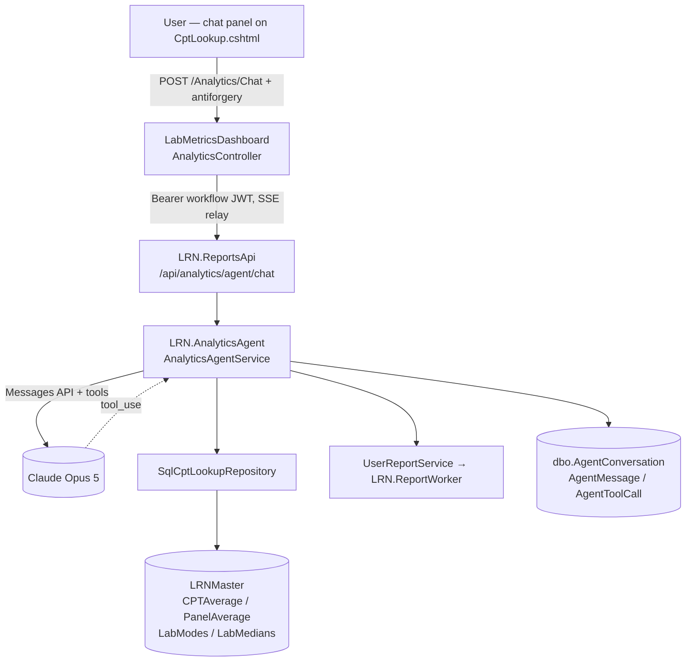

# CPT & Panel Lookup — Agentic Chat

Design document for a conversational agent over `dbo.CPTAverage`, `dbo.PanelAverage`,
`dbo.LabModes` and `dbo.LabMedians` — the same four LRNMaster tables that back
`Analytics > CPT & Panel Lookup`.

**Status:** proposal. Nothing here is built yet.

---

## 1. What this is

A chat panel on the CPT & Panel Lookup screen where a user asks in plain English:

* *"What does Aetna pay for 80307 at Cove, YTD?"*
* *"Which payer pays the least on the ATI tox panel?"*
* *"Top 10 CPTs by denial rate for lab 12 over the last 90 days."*
* *"Has 84443 gone up or down between Rolling90 and YTD?"*
* *"Why is the mode rate blank for this row?"*
* *"Export everything we just looked at."*

The agent answers by **calling the existing lookup repository as tools** — not by
writing SQL, and not from anything it "knows". Every number in an answer traces to a
row the tool returned. It is the same data the grid shows, reached by asking instead of
by filling in four filter boxes.

### What it is not

* Not a text-to-SQL system. The model never emits SQL; it fills in a typed filter
  object that `SqlCptLookupRepository` already validates.
* Not a new data source. If the grid can't show it, the agent can't answer it.
* Not a forecasting or benchmarking tool. It reports what is in the averages tables.

---

## 2. Why this shape

Three facts about the existing code decide most of the architecture:

1. **The repository is already the right tool surface.** `GetCptAsync`,
   `GetPanelAsync`, `GetCptWindowsAsync`, `GetPanelWindowsAsync`, `GetCptOptionsAsync`
   and `GetLabsAsync` cover roughly 80% of what people will ask. Sorting is already
   whitelisted (`CptSortColumns`), filters are already parameterised, and
   `LookupResult<T>.Summary` already carries row count, average allowed, average paid
   and denial rate over the whole filtered set — not just the page. Wrapping these as
   agent tools is a thin adapter, not a rewrite.

2. **Ranking questions need no new SQL.** "Top 10 CPTs by denial rate" is
   `lookup_cpt(labId: 12, windowType: "Rolling90", sortColumn: "denialRate",
   sortDirection: "desc", pageSize: 10)`. The whitelist already contains `denialRate`,
   `modeAllowedAmount`, `avgPaidAmountPerUnit` and the rest. This is the single biggest
   reason the first release can be small.

3. **The data has two traps the agent must never paper over.** The payer names in
   `LabModes`/`LabMedians` only partly overlap `CPTAverage.PayerDisplayName`, so a rate
   may be the payer's own or the lab-wide fallback — `ModeMatch`/`MedianMatch` says
   which. And a panel-level mode is the *average of the per-CPT modes*, over
   `ModeCptCount` codes. Both must appear in the answer, not just in the tooltip the
   grid shows. See §6.

---

## 3. Requirements

### 3.1 Functional

| # | Requirement |
|---|---|
| F1 | Ask about a CPT code, a panel, a payer, a lab, or a window, in any combination, in natural language. |
| F2 | Resolve loose names to real values — "Aetna" → the exact `PayerDisplayName`, "tox screen" → the panel name, "Cove" → a `LabId`. Ask the user to choose when a term is ambiguous. |
| F3 | Answer with the same figures the grid shows: avg charge/allowed/paid per unit, median, P25/P75, mode allowed/paid, line counts, denial rate. |
| F4 | Rank and compare within a filtered set (top/bottom N by any sortable column). |
| F5 | Compare the same key across windows (YTD / Rolling180 / Rolling90) and state the direction and size of the change. |
| F6 | State the scope of every answer: lab, CPT/panel, payer, window, and the row's `StartDate`–`EndDate`. |
| F7 | State rate provenance: payer-specific vs lab-wide fallback, and the CPT count behind a panel mode. |
| F8 | Say "no data for that" plainly when the filter matches zero rows. Never fill the gap. |
| F9 | Hand off to the existing background export: "export that" queues a `CptLookup`/`PanelLookup` report with the filters from the conversation and returns the report id. |
| F10 | Multi-turn: "and for Rolling90?" carries the previous filters forward. |
| F11 | Apply the conversation's filters to the grid behind the chat panel ("show me that in the table"). |

### 3.2 Non-functional

| # | Requirement |
|---|---|
| N1 | First token within ~2s; a full tool-using answer within ~15s. Streamed, so the user sees progress. |
| N2 | No answer contains a number the model did not receive from a tool result. |
| N3 | The agent's data reach is exactly the lookup page's reach — no new tables, no new columns, no lab the page wouldn't show. |
| N4 | Every conversation, tool call, tool argument, and token count is persisted for audit and cost attribution. |
| N5 | Hard per-turn ceilings: max tool iterations, max rows per tool result, max output tokens, wall-clock timeout. |
| N6 | Per-user and per-org daily token budget, enforced server-side, with a clear message when exhausted. |
| N7 | If the model provider is unreachable or the feature flag is off, the lookup page works exactly as it does today. The chat panel simply doesn't render. |
| N8 | The chat panel obeys the dashboard CSP (script nonce, no external hosts). |

### 3.3 Explicitly out of scope for v1

Free-form SQL; cross-lab benchmarking narratives; anything touching claim-line or
patient-level tables; writing back to any table; scheduled/proactive insights;
non-English input.

---

## 4. Tech stack

| Layer | Choice | Why |
|---|---|---|
| Model | **Claude Opus 5** (`claude-opus-5`) | Strongest on the multi-step tool loops these questions need (resolve name → look up → compare → answer). Configurable; `claude-sonnet-5` is a valid cost-down swap once the eval suite is in place. |
| SDK | Official **Anthropic .NET SDK** (`Anthropic` NuGet) | First-party, typed, same Messages API surface as every other language. |
| Agent loop | `client.Beta.Messages.ToolRunner(...)` (`BetaToolRunner`) with raw JSON-schema tool definitions | Runs the request → execute tool → feed result → repeat cycle. Per-turn hooks still allow row capping, argument validation and logging before a tool runs. |
| Thinking | `thinking: { type: "adaptive" }` | On by default on Opus 5. Leave it on — the disabled path has failure modes (tool calls emitted as plain text). |
| Effort | `output_config.effort = "high"`, tunable per route | Sweep `low`/`medium` once evals exist; both are strong on this model and are the main latency/cost lever. |
| Streaming | SSE, `client.Beta.Messages.Stream(...)` | Tool loops take seconds; the user needs to see it working. |
| Prompt caching | `cache_control: ephemeral` on the last system block | System prompt + tool schemas are a stable prefix and will exceed the 512-token minimum. Roughly 90% off the repeated prefix. |
| Agent host | New class library **`LRN.AnalyticsAgent`**, referenced by `LRN.ReportsApi` | Co-located with `SqlCptLookupRepository`, so tool calls are in-process against LRNMaster — no HTTP hop per tool call. |
| API surface | `POST /api/analytics/agent/chat` (SSE) on LRN.ReportsApi | The `/api/analytics` prefix is already JWT-guarded in `Program.cs`; the agent inherits that with no middleware change. |
| Dashboard | `AnalyticsController.Chat` proxying through `LabAnalyticsApiClient`, plus a `_AgentChat.cshtml` partial on `CptLookup.cshtml` | Same JWT handshake as every other analytics call. |
| Front end | Vanilla JS + Bootstrap, nonce'd inline script, `EventSource`-style SSE read via `fetch` + `ReadableStream` | Matches `CptLookup.cshtml`; no build step, no new client dependency. |
| Conversation store | New LRNMaster tables `dbo.AgentConversation` / `dbo.AgentMessage` / `dbo.AgentToolCall` | Needed for N4 anyway; also survives an app-pool recycle mid-conversation. |
| Secrets | `Anthropic:ApiKey` in `appsettings.Local.json` / env var, never in tracked config | Same rule as every other secret in this repo (see `LRN.ReportsApi/Program.cs`). |

**Version note.** `LRN.ReportsApi` targets `net8.0`, the dashboard `net9.0`. Confirm the
Anthropic SDK's TFM before wiring it in; if it needs net9.0, either retarget
`LRN.ReportsApi` or host `LRN.AnalyticsAgent` behind an interface that the API calls
over a local endpoint. Prefer retargeting — the in-process tool path is worth keeping.

### Why not Managed Agents

Anthropic's Managed Agents run the loop *and* host a sandbox on Anthropic's side. The
tools here read an on-prem SQL Server behind the org's own JWT; that compute has to stay
ours. Claude API + tool runner is the right tier. Revisit only if the agent ever needs a
long-lived workspace with files.

---

## 5. Architecture



### Request flow, one turn

1. Browser posts `{ conversationId, message, gridContext }` to the dashboard.
   `gridContext` is the panel's *current* filter state — the agent starts from what the
   user is already looking at.
2. Dashboard issues the workflow JWT (`WorkflowJwtIssuer`) and relays to the API with
   `HttpCompletionOption.ResponseHeadersRead`, then copies the SSE stream to its own
   response. **The dashboard's 120s `HttpClient` timeout applies to headers only in this
   mode** — this is the same trap that broke the synchronous export
   (see `CptPanelLookup_BackgroundExport.md`), so the streaming read must not be
   buffered.
3. `AnalyticsAgentService` loads history, builds the request (cached system prefix +
   tool schemas + history + new turn), and runs the tool runner.
4. Each `tool_use` is validated, executed against the repository, capped, and returned.
   Text deltas stream out as they arrive.
5. Final assistant message, tool calls, and `usage` are persisted.

---

## 6. Tools

All tool inputs are `strict: true` JSON Schema with `additionalProperties: false`, and
every value is re-validated server-side before it reaches the repository. The model
cannot widen the sort whitelist, exceed the page cap, or reach a table the repository
doesn't expose.

| Tool | Wraps | Notes |
|---|---|---|
| `list_labs` | `GetLabsAsync` | Returns `{ labId, labName }`. `LabName` is **not unique** (two `LabId`s both spell themselves "NorthWest") — the agent must disambiguate by id, and say which id it used. |
| `resolve_filter_value` | `GetCptOptionsAsync` / `GetPanelOptionsAsync` | `field` ∈ `cptCode`/`panelName`/`payer`. The mandatory first hop for any name the user typed. Returns up to 100 matches; if >1, the agent asks rather than guessing. |
| `lookup_cpt` | `GetCptAsync` | Full `LookupQuery` surface. Returns `{ summary, totalCount, returnedCount, rows[] }`. |
| `lookup_panel` | `GetPanelAsync` | Same shape. |
| `compare_cpt_windows` | `GetCptWindowsAsync` | One CPT+panel+payer across every window it has data for. |
| `compare_panel_windows` | `GetPanelWindowsAsync` | Same, panel-level. |
| `queue_export` | `UserReportService.QueueAsync` with `CptLookupReportFilters` | Queues against `ReportQueueLabs.Master`, exactly as the export button does. Returns `reportId`; the file lands in the Reports panel. **Gated on user confirmation** (see §7). |
| `apply_grid_filters` | *(client-side)* | Emits a filter object the chat panel applies to the grid behind it. No data access. |

### Tool result shape and truncation

A tool result is never raw rows alone:

```json
{
  "scope":  { "labId": 12, "labName": "Cove", "cptCode": "80307", "panelName": null,
              "payer": "AETNA", "windowType": "YTD",
              "startDate": "2026-01-01", "endDate": "2026-08-15" },
  "summary":{ "rowCount": 143, "avgAllowed": 42.18, "avgPaid": 31.07, "denialRate": 6.4 },
  "totalCount": 143,
  "returnedCount": 25,
  "truncated": true,
  "rows": [ /* ≤ 25 rows, grid column set, nulls preserved */ ]
}
```

Rules:

* **`pageSize` is capped at 25 for the agent**, well under the repository's
  `MaxPageSize` of 1000. Rows are for reasoning, not for dumping; a wide result blows
  the context window and the answer gets worse, not better.
* `truncated: true` obliges the agent to say the set is larger and offer `queue_export`.
* `summary` is computed over **every** matching row, so the agent can answer
  "what's the average across all of them" correctly from a truncated page.
* Nulls stay null. A missing mode rate is a real, expected state — the agent renders it
  as "no mode rate available", never as zero.

### The two provenance rules

These are the difference between an answer people trust and one they don't:

1. **Rate fallback.** When `ModeMatch`/`MedianMatch` is `"lab"`, the figure is the
   lab-wide rate because `LabModes`/`LabMedians` has no row for that payer. The agent
   must say so: *"$38.00 — that's Cove's lab-wide mode, not Aetna's own; LabModes has no
   Aetna row for this code."* When it is `null`, there is no mode rate at all.
2. **Panel modes are averages of CPT modes.** A panel `ModeAllowedAmount` is `AVG()`
   over `ModeCptCount` distinct CPT codes. A panel figure resting on 1 CPT is not the
   same claim as one resting on 14, and the agent must quote the count.

Both rules go in the system prompt *and* are asserted in the eval suite (§10).

---

## 7. Guardrails

**Grounding.** The system prompt states: every figure must come from a tool result in
this conversation; if a tool returned nothing, say so; never estimate, interpolate, or
carry a number across a scope change. Prefix the answer with the scope (lab, code,
payer, window, date range).

**Tool-argument validation.** The tool runner's pre-execution hook re-validates every
argument against the same rules the controller enforces today: sort column must be in
the whitelist, `windowType` ∈ `YTD`/`Rolling180`/`Rolling90`, `pageSize` clamped,
`labId` must exist. A rejected call returns `is_error: true` with a reason so the model
corrects itself instead of the turn failing.

**Authorization.** The agent's reach is defined by `SqlCptLookupRepository` and the
`/api/analytics` JWT gate — identical to the grid. No tool takes a table name, a column
list, or a connection string. If lab-scoping is ever added to the lookup page, it must
be enforced in the repository (not the prompt) so the agent inherits it automatically.
**A prompt instruction is not an access control.**

**Confirmation before side effects.** `queue_export` is the only tool with an effect
outside the read path. It is gated: the agent proposes the export with its exact
filters, and the panel renders a confirm button. The tool does not run until the user
clicks. Same reasoning as `[ValidateAntiForgeryToken]` on `QueueExport` today.

**Prompt injection.** Tool results are data from our own database, not the open web, so
the exposure is low — but `PanelName` and `PayerDisplayName` are free-text columns
sourced from imports. Tool results are wrapped as data and the system prompt states that
instructions appearing inside tool results are never followed.

**Ceilings.** Max 8 tool iterations per turn, max 25 rows per tool result, `max_tokens`
sized for a streamed answer, 60s wall clock. Per-user daily token budget checked before
the call and updated after; over budget returns a plain message, not an error page.

---

## 8. Data sent to Anthropic

Worth being explicit, because it is the question compliance will ask first.

The four source tables hold **aggregates**: average and median dollar amounts per unit,
mode rates, percentiles, and line counts, keyed by lab + CPT + panel + payer + window.
There are no patient identifiers, no claim numbers, no dates of service, no provider
identifiers — nothing that identifies an individual. What leaves the building is
therefore payer-rate and volume data, which is commercially sensitive but not PHI.

Decisions to make before build:

* **Confirm the above with whoever owns the BAA/compliance posture.** Do not treat this
  document as that sign-off.
* **Zero data retention** is available on the Claude API and is compatible with Opus 5.
  Request it if the org wants nothing retained.
* **Deployment option.** If contract or residency terms require it, the same SDK code
  runs against Amazon Bedrock, Google Vertex AI, or Microsoft Foundry by swapping the
  client class — but note fast mode, Message Batches and some server tools are
  first-party only. None of those are needed here.
* Lab names and payer names are in the payload by construction; they are the question.

---

## 9. Cost

At Opus 5 list pricing ($5 / MTok input, $25 / MTok output):

| Component | Tokens/turn (est.) | Notes |
|---|---|---|
| System prompt + tool schemas | ~2,500 | Cached after the first turn (~90% off, 512-token minimum easily met). |
| Conversation history | 500–4,000 | Grows; trimmed or compacted past ~20 turns. |
| Tool results | 1,000–4,000 | The 25-row cap is what keeps this bounded. |
| Output (incl. thinking) | 400–1,200 | `effort` is the lever. |

Rough order of magnitude: **a few cents per turn**, dominated by tool results and
history. The cost controls that matter, in order: the row cap, prompt caching, `effort`,
then model choice. Measure with `usage` on every response — the audit table (§5) exists
partly for this — before considering a model downgrade.

---

## 10. Evaluation

Prompt quality is not testable by inspection. Build the eval set alongside the tools.

* **Golden set:** ~40 questions with answers computed independently in SQL — a mix of
  single-lookup, ranking, window-comparison, payer-fallback, empty-result, and
  ambiguous-name cases.
* **Assertions:** the number matches; the scope is stated; `ModeMatch`/`ModeCptCount`
  provenance is stated where it applies; empty results are reported as empty; no tool
  call violates the whitelist.
* **Adversarial cases:** a CPT that exists in `CPTAverage` but has no `LabModes` row; a
  panel whose mode rests on one CPT; a lab name that maps to two `LabId`s; a payer that
  exists in `LabModes` but not `CPTAverage`; a question the data cannot answer at all
  ("what will Aetna pay next quarter").
* Run in CI against a seeded test database, alongside `CptLookupExportPagingTests`.

A regression here looks like a confidently wrong dollar figure, which is worse than an
outage. Treat a failing eval as a release blocker.

---

## 11. Delivery plan

| Phase | Scope | Exit criteria |
|---|---|---|
| **0 — Spike** | SDK wired into `LRN.ReportsApi`, one tool (`lookup_cpt`), console harness, no UI | A question answered end to end against real LRNMaster data. TFM question settled. |
| **1 — Read-only chat** | All six read tools, system prompt, grounding rules, SSE endpoint, chat panel on `CptLookup.cshtml`, conversation persistence, ceilings, feature flag | Golden set passes; the page is unchanged when the flag is off |
| **2 — Context & comparison** | `gridContext` seeding, `apply_grid_filters`, window comparisons phrased as trends, multi-turn filter carry-forward, small inline charts | "and for Rolling90?" works; grid and chat stay in sync |
| **3 — Export handoff** | `queue_export` with the confirm gate, Reports-panel deep link | Export queued from chat is byte-identical to the button's |
| **4 — Aggregation** | New repository methods for grouped aggregates the page can't express ("average across all payers per CPT"), exposed as one `aggregate_cpt` tool | New SQL is covered by its own tests before the tool ships |

Phases 1–3 need **no new SQL** — that is the point of §2.2. Phase 4 is the first time
the agent's reach exceeds the grid's, and it should be a deliberate decision, not a
drift.

---

## 12. Open questions

1. **Compliance sign-off** on sending aggregate rate data to a third-party model
   provider — and whether ZDR is required. Blocks Phase 0 going near production data.
2. **TFM**: retarget `LRN.ReportsApi` to net9.0, or split the agent out of process?
3. **Lab scoping.** The lookup page today lets any authenticated user query any lab.
   Is that intentional? The agent makes cross-lab questions trivial to ask, which turns
   a quiet property into a visible one.
4. **Model choice policy** — is Opus 5 the default, or does cost push to Sonnet 5 from
   day one? Needs the eval set to answer honestly.
5. **Conversation retention** — how long do we keep `AgentMessage` rows, and does the
   audit requirement conflict with any retention policy?
6. **Who owns the prompt?** It is a versioned artifact with test coverage, not a config
   string. It should live in the repo and change through PRs.

---

## 13. References

* `LRN.ReportsApi/Services/CptLookupService.cs` — the repository the tools wrap; read the
  class comment for why the joins look the way they do.
* `LRN.ReportsApi/Models/LabAnalyticsModels.cs` — `LookupQuery`, `CptLookupRow`,
  `PanelLookupRow`, `LookupSummary`.
* `LabMetricsDashboard/Controllers/AnalyticsController.cs` — the proxy pattern and the
  JWT handshake the chat endpoint reuses.
* `docs/CptPanelLookup_BackgroundExport.md` — the queue path `queue_export` reuses, and
  the `HttpClient` timeout trap the SSE relay must avoid.
* `tests/LRN.ReportsApi.Tests/CptLookupExportPagingTests.cs` — the existing guard on the
  page-size contract the agent's row cap sits under.
